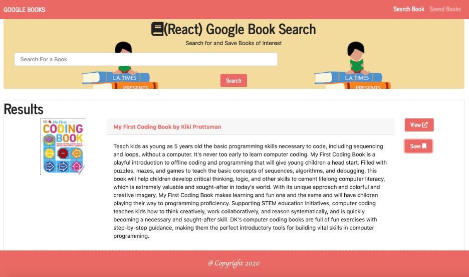

# MERN-Google-Books-Search

### Overview

A new React-based Google Books Search app with React components based on helper/util functions, and utilizing React lifecycle methods to query and display books based on user searches. Node, Express and MongoDB are used for users be able to save books to review or purchase later.

[Heroku Page](https://mern-googlebooks-search.herokuapp.com/)

